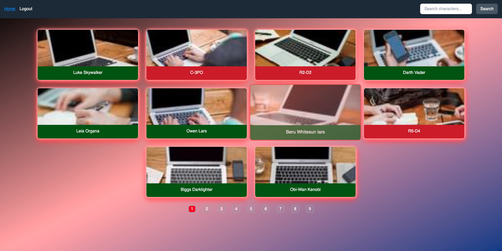
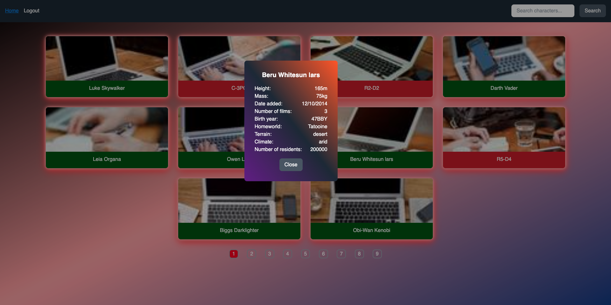
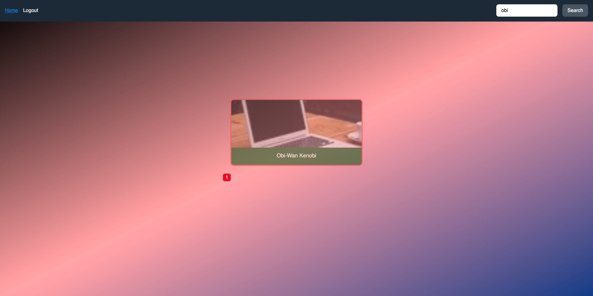
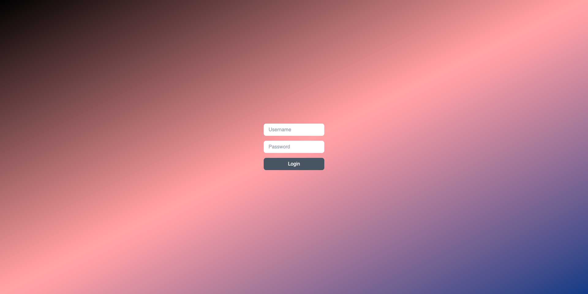

<a name="readme-top"></a>

<div align="center">
  <h3><b>Lasto Enjoy Star Wars</b></h3>
</div>

<!-- TABLE OF CONTENTS -->

# 📗 Table of Contents

- [📗 Table of Contents](#-table-of-contents)
- [📖 Lasto-Enjoy-Star-Wars ](#-lasto-enjoy-star-wars-)
  - [Pull Request](#pull-request)
  - [Screenshots ](#screenshots-)
  - [🛠 Built With ](#-built-with-)
    - [Tech Stack ](#tech-stack-)
    - [Key Features ](#key-features-)
  - [🚀 Live Demo ](#-live-demo-)
  - [ERD Diagram (simplified) ](#erd-diagram-simplified-)
  - [💻 Getting Started ](#-getting-started-)
    - [Prerequisites](#prerequisites)
    - [Setup](#setup)
    - [Install](#install)
    - [Usage](#usage)
    - [Run tests](#run-tests)
  - [👥 Authors ](#-authors-)
  - [🤝 Contributing ](#-contributing-)
  - [⭐️ Show your support ](#️-show-your-support-)
  - [🙏 Acknowledgments ](#-acknowledgments-)
  - [📝 License ](#-license-)

<!-- PROJECT DESCRIPTION -->

# 📖 Lasto-Enjoy-Star-Wars <a name="about-project"></a>

**Lasto-Enjoy-Star-Wars** is an assignment given to me by [Lasto-Enjoy](https://www.lastoenjoy.org/) to display my frontend skills.

<!-- ## Presentation -->

<!-- - Click [HERE](https://drive.google.com/file/d/1SLUdlyzRBvoKv63vYlCwLDKHPUH2_RZb/view?usp=sharing) to view the project presentation -->

## Screenshots <a name="screenshots"></a>

- Character List
  

- Character Modal
  

- Search Result
  

- Login Page
  

## 🛠 Built With <a name="built-with"></a>

### Tech Stack <a name="tech-stack"></a>

<details>
  <summary>Client</summary>
  <ul>
    <li><a href="https://reactjs.org/">React.js</a></li>
    <li><a href="https://www.typescriptlang.org/">Typescript.js</a></li>
    <li><a href="https://vitejs.dev/">Vite.js</a></li>
    <li><a href="https://tailwindcss.com/">TailwindCSS</a></li>
  </ul>
</details>

<!-- Features -->

### Key Features <a name="key-features"></a>

- **Star Wars Characters Manipulation**

<p align="right">(<a href="#readme-top">back to top</a>)</p>

<!-- LIVE DEMO -->

## 🚀 Live Demo <a name="live-demo"></a>

- [Live Demo Link](https://lasto-enjoy.vercel.app/)

<p align="right">(<a href="#readme-top">back to top</a>)</p>

<!-- GETTING STARTED -->

## 💻 Getting Started <a name="getting-started"></a>

To get a local copy up and running, follow these steps.

### Prerequisites

In order to run this project you need download [Node.js](https://nodejs.org/en):

Check your node installation is complete.

```sh
  node --version
```

### Setup

Clone this repository or download as a zip file to your desired folder:

```sh
  cd my-folder
  git clone git@github.com:rex-9/LastoEnjoy.git
```

### Install

Install this project with:

```sh
  cd LastoEnjoy
  npm install
```

### Usage

To run the project, execute the following command:

```sh
  npm run dev
```

<p align="right">(<a href="#readme-top">back to top</a>)</p>

<!-- AUTHORS -->

## 👥 Authors <a name="authors"></a>

👤 **Htet Naing (Rex)**

- GitHub: [@rex-9](https://github.com/rex-9)
- Bento: [@rex9](https://bento.me/rex9)
- LinkedIn: [@rex9](https://linkedin.com/in/rex9)

<p align="right">(<a href="#readme-top">back to top</a>)</p>

<!-- CONTRIBUTING -->

## 🤝 Contributing <a name="contributing"></a>

Contributions, issues, and feature requests are welcome!

Feel free to check the [issues page](../../issues/).

<p align="right">(<a href="#readme-top">back to top</a>)</p>

<!-- SUPPORT -->

## ⭐️ Show your support <a name="support"></a>

If you like this project, please remember me, Rex9.

<p align="right">(<a href="#readme-top">back to top</a>)</p>

<!-- ACKNOWLEDGEMENTS -->

## 🙏 Acknowledgments <a name="acknowledgements"></a>

I would like to thank [Lasto-Enjoy](https://www.lastoenjoy.org/) for this wonderful challenge.

<p align="right">(<a href="#readme-top">back to top</a>)</p>

<!-- LICENSE -->

## 📝 License <a name="license"></a>

This project is [MIT](./LICENSE) licensed.

<p align="right">(<a href="#readme-top">back to top</a>)</p>
